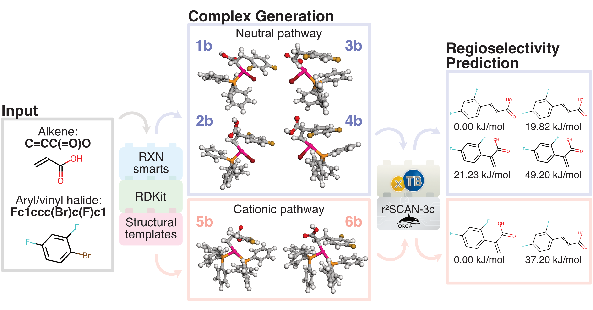

# What the Heck? - Automated regioselectivity calculations of palladium-catalyzed Heck reactions using quantum chemistry

This repository contains code for running a quantum chemistry (QM)-based workflow that computes relative energies of intermediates in the Heck reaction that relate to the regioselective reaction outcome: branched (𝛂), linear (𝛃), or a mix of the two.
The method applies to cross-couplings of monosubstituted alkenes with aryl/vinyl halides (Cl, Br, or I) or triflates in the presence of a base and a palladium (Pd) catalyst with monodentate triphenylphosphine ligands to form branched and/or linear disubstituted alkenes.
In fact, the workflow can also handle intramolecular Heck reactions of similar type.

Furthermore, we provide supporting material for data extraction and preparation used in the design and testing of the workflow.

<p align="center">
    
</p>


## Install

For the installation, we recommend using `conda` to get all the necessary dependencies:

    conda env create -f environment.yml && conda activate heckqm


Then download the binaries of xtb version 6.4.1:

    mkdir dep; cd dep; wget https://github.com/grimme-lab/xtb/releases/download/v6.4.1/xtb-6.4.1-linux-x86_64.tar.xz; tar -xvf ./xtb-6.4.1-linux-x86_64.tar.xz; cd ..


Furthermore, ORCA version 5.0.1 must be installed following the instructions found here: https://sites.google.com/site/orcainputlibrary/setting-up-orca

OBS! 
  1) The path to ORCA must be modified in "heckqm/run_orca.py".
  2) The number of available CPUs and memory must be modified to match your hardware.


## Usage

An example of usage via CLI command (takes ~10 min. on 2x16 CPU cores):

    # Create predictions for an intermolecular Heck reaction:
    python heckQM_CLI.py --alkene_smi 'C=CC' --halogen_smi 'c1ccccc1Cl' --name 'test' &
    

The calculations are now saved in a "calc" folder and a graphical output of the results (in .html format) are found in a "results" folder.
The graphical output presents the user with results for the two different reaction pathways (neutral and cationic), and shows the potential products in order of increasing energies of the post-insertion complexes.

An example of using HeckQM on a dataframe (takes ~20 min. on 16 CPU cores):

    # Create predictions for "3d" from the Cabri dataset (data/cabri/data_cabri.pkl):
    python heckQM.py

The calculations are now saved in a "calc" folder, and a dataframe containing the results are found in "submitit_heckqm/*_result.pkl"


## Data Extraction

The Cabri dataset is available under "data/cabri/data_cabri.pkl", however the Reaxys dataset cannot be shared directly due to licensing restrictions.
Fortunately, it can easily be extracted from Reaxys via a single Reaxys query and a list of Reaction IDs separated by semicolons by following these instructions:

  1. Go to the “Query builder” tab in Reaxys.
  2. Use the “Search fields” functionality located in the top-right part of the window.
  3. Input “Reacton ID".
  4. Select "Reaction ID” from the filtered list. At the center of the page, the input field will appear.
  5. Paste the provided list of Reaction IDs into the input field.
  6. Clicking on the “Reactions” button will redirect the user to the result page with all the reactions corresponding to Reaction IDs that have been provided.

Otherwise follow the procedure provided in "data/reaxys/curation/info.md".


## Citation 

Our work is online as a preprint on [ChemRxiv](http://doi.org/10.26434/chemrxiv-2022-9pslv), where more information is available. 

```
@article{ree2022heckqm,
  title={What the Heck? - Automated regioselectivity calculations of palladium-catalyzed Heck reactions using quantum chemistry},
  author={Ree, Nicolai and Göller, Andreas H and Jensen, Jan H},
  journal={},
  volume={},
  number={},
  pages={},
  year={2022},
  publisher={}
}
```
